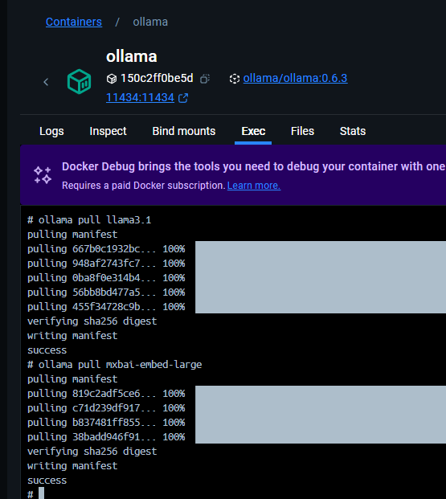

# Local AI Development Stack

This repository demonstrates how to build and run AI applications locally using a dev container. The stack includes:

- [Python:3.13.2-slim](https://hub.docker.com/layers/library/python/3.13.2-slim/images/sha256-cdd05847ea468adac731f07eebdd700920cdba58caca6ef25bf8fa8261eb26fc): Popular language for AI development.
- [ChromaDB](https://hub.docker.com/r/chromadb/chroma): Vector database for RAG applications.
- [Ollama:0.6.3](https://hub.docker.com/layers/ollama/ollama/0.6.3/images/sha256-3357d9dbb374fd82ee59e2fa47e3935e48bed3dd0bad8291374700cb66fe7232): Simplified local LLM runner.
- [PostgreSQL:16.2-alpine3.19](https://hub.docker.com/layers/library/postgres/16.2-alpine3.19/images/sha256-8e50de55645e01728c523ab17dbf3c2f61f68bc3a8d73c86a6c55509a2bc4a22): Relational database for non-vector data.

### Prerequisites
- Docker runner (Docker Desktop for example)
- The "Remote Development" extension in Visual Studio Code
- WSL Installed (Windows Only)
- Docker configured to use WSL (Windows Only)


- **GPU Support**: Requires NVIDIA GPU, WSL with Docker integration, and [NVIDIA Container Toolkit](https://docs.nvidia.com/datacenter/cloud-native/container-toolkit/latest/install-guide.html#installation).
- **CPU-Only Setup**: Comment out the `deploy` key in the `ollama` service in `docker-compose.yml`:
  ```yaml
  # deploy:
  #   resources:
  #     reservations:
  #       devices:
  #         - driver: nvidia
  #           count: all
  #           capabilities: [gpu]
  ```

### Services and Ports
- **ChromaDB**: `chroma:8000`
- **Ollama**: `ollama:11434`
- **PostgreSQL**: `postgres:5432`

### Build the dev container
Open the command pallet in Visual Studio Code and select "Dev Containers: Rebuild and Reopen in Container".

### Pull the LLMs
Attach a shell to the "ollama" container and execute the following commands:

```bash
ollama pull llama3.1
ollama pull mxbai-embed-large
```



### Examples
This repository includes examples for:
- Chunking and embedding documents.
- Storing embeddings in ChromaDB.
- Querying the index and LLM.

The examples are inspired by [Microsoft's RAG tutorial](https://learn.microsoft.com/en-us/azure/search/tutorial-rag-build-solution), with key differences:
- Uses ChromaDB instead of Azure Cognitive Search.
- Embeddings are generated via Ollama or ChromaDB's embedding methods.

### Getting Started
1. Download sample PDFs from [Azure Samples](https://github.com/Azure-Samples/azure-search-sample-data/tree/main/nasa-e-book/earth_book_2019_text_pages).
2. Copy them to the `docs1` folder in this repository.
3. Update the `query_text` in the code to match your documents.

Alternatively, use your own PDFs by placing them in `docs1` or another folder, updating the code as needed.

### Additional Resources
- [WSL Installation Guide](https://learn.microsoft.com/en-us/windows/wsl/install)
- [NVIDIA Container Toolkit Installation](https://docs.nvidia.com/datacenter/cloud-native/container-toolkit/latest/install-guide.html#installation)